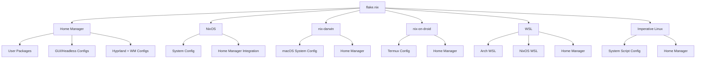

# dotfiles

My dotfiles utilizing the [Nix ecosystem](https://nixos.org).
Fully modular and reproducible dotfiles and system configuration for multiple operating systems and environments.
Infrastructure and system configuration as code, I can be on whatever, whenever and however.

## Overview

This setup uses:

- [Nix Flakes](https://nixos.wiki/wiki/Flakes): for reproducible and composable configurations.
- [Home Manager](https://nix-community.github.io/home-manager/): to manage user environments across platforms.
- [NixOS](https://nixos.org): declarative system configuration.
- [nix-darwin](https://github.com/LnL7/nix-darwin): Nix-based macOS system configuration.
- [nix-on-droid](https://github.com/t184256/nix-on-droid): Nix on Android's Termux.
- [WSL](https://learn.microsoft.com/en-us/windows/wsl/) integration (both NixOS and Arch-based environments).
- Traditional imperative distros (primarily [Arch Linux](https://archlinux.org/))via bootstrapping scripts.


## Features

### Home Manager

[Home Manager](https://github.com/nix-community/home-manager) is the core of my dotfiles.
Utilized to bootstrap my home; packages, dot configurations, preparing base look and feel, everything I need.

It is agnostic to any distro (linux and wsl) and macos.

Packages are seperated
```tree
├──  home
│   ├──  modules (modular code for clean codebase based on functionality)
│   └──  packages
│       ├──  gui-contentCreation (packages/suites used for content creation; blender, DAWs)
│       ├──  gui-devel (gui packages used for development; vscode)
│       ├──  gui-essentials (gui packages for general/daily use; browser, messaging)
│       ├──  headless-devel (cli and tui packages for terminal/tty development; neovim)
│       └──  headless-essentials (cli and tui packages for general/daily use; git, ssh, shell)
```


There are multiple configurations that can bootstrap packages by environment and class;

```sh
home-manager switch --flake /location/of/flake.nix#nooneknows@headless --impure # all my cli and tui packages and dot configs for headless (terminal/tty) development; remote ssh, vps

home-manager switch --flake /location/of/flake.nix#nooneknows@linux # all my cli, tui, gui packages, desktop environment (hyprland); fully functional dekstop environent
```

There is also a [stylix](https://github.com/nix-community/stylix) module. 
It unifies styling parameters, colorschemes and so on across my machines, consistent appearance; 
font, colorscheme (Black Metal Theme), etc.


### Linux

- Seperated by architecture
- Utilize Home Manager; seperate user configs and packages per environment (tty, desktop, android)
- Modular; specific system configurations and shared modules among systems
- Scripts for bootstraping and imperative configuration on non-NixOS systems; Arch with Home Manager

#### NixOS

- Seperate configurations and packages for each system while using home-manager for a unified home (user)
- Shared modules between hosts; common features and configurations

#### Arch Linux (Imperative)

- System configuration is handled by scripts; `systemctl` enable services
- Package management via `pacman` for system-level packages
- Nix is used declaratively at the user level via Home Manager

#### Android (Termux)

- A headless aarch64 setup
- Nix-on-droid setup; system/termux configuration
- Utilizes Home Manager for user development environment; CLI and TUI packages

#### Headless
- Home Manager x86-64 based headless linux development environment
- No system configurations
- Uses top-level flake parameters for easy configuration for ephemiral setups
<!-- (ignored as an artifact in `.gitignore`, `headless.nix`); -->

```nix
# remote / vps development
{inputs, pkgs, config}: {
    
    let
        username = "anyone";
    in
    "${username}@headless" = home-manager.lib.homeManagerConfiguration {
        pkgs = nixpkgs.legacyPackages.x86_64-linux;

        extraSpecialArgs = let
            username = "${username}";
            homeDirectory = "/home/${username}";
        in {
            inherit inputs;
            inherit username;
            inherit homeDirectory;
        };

        modules = [
            inputs.stylix.homeModules.stylix
            ./linux/hosts/x86-64/headless/home.nix
        ];
    };
    
}
```

### macOS (nix-darwin)

- Uses `nix-darwin` for system configuration; look and feel, preferences
- Utilizes Home Manager
- macOS-specific scripts and modules are isolated

### Windows (WSL)

- Powershell scripts to install windows packages; terminal, git and set up WSL
- Options for:
  - NixOS-based WSL environments
  - Arch-based WSL environments
- Home Manager is used inside WSL to manage user space

### Backwards Compatibility

Although this repository is designed around Nix flakes and Home Manager(symlink bi-directionally using `config.lib.file.mkOutOfStoreSymlink`), 
it maintains backwards compatibility with traditional dotfiles management tools 
like stow and provides easy top-level access to frequently-edited configurations.

- Commonly edited configs (e.g., nvim, tmux, git, etc.) are symlinked or surfaced in the top-level directory.
- Compatible with both declarative (Nix-based) and imperative (stow/manual) workflows.
- Great for bootstrapping or lightweight setups without full Nix integration.

## Project Structure (Philosophy)

```tree
 dotfiles
├──  .github
│   └──  workflows (ci/cd; codebase formatting and linting)
├──  configs (software configurations and behavior; .config)
├──  darwin
│   ├── 󰀂 hosts (each owned node/machine with independent configuration seperated by instruction set architecture, look below for an exploded view)
│   ├──  modules (shared modules; configurations between darwin (macos) nodes)
│   ├──  packages (shared system packages between nodes)
│   └──  scripts (shared scripts between nodes)
├──  home
│   ├──  modules (modular code for clean codebase based on functionality)
│   └──  packages
│       ├──  gui-contentCreation (packages/suites used for content creation; blender, DAWs)
│       ├──  gui-devel (gui packages used for development; vscode)
│       ├──  gui-essentials (gui packages for general/daily use; browser, messaging)
│       ├──  headless-devel (cli and tui packages for terminal/tty development; neovim)
│       └──  headless-essentials (cli and tui packages for general/daily use; git, ssh, shell)
├──  linux
│   ├── 󰀂 hosts (exploded view)
│   │   ├──  aarch64 (architecture)
│   │   │   └──  system-codename
│   │   │       └──  packages (system specific packages)
│   │   └──  x86-64
│   │       ├──  headless (headless development on x86-64 machines; remote ssh, vps)
│   │       └──  system-codename
│   │           ├──  modules (system specific modules)
│   │           │   ├──  audio
│   │           │   ├──  boot
│   │           │   ├──  console
│   │           │   ├──  environment
│   │           │   ├──  hardware
│   │           │   ├──  locale
│   │           │   ├──  misc
│   │           │   ├──  networking
│   │           │   ├──  programs
│   │           │   ├──  services
│   │           │   ├──  system
│   │           │   ├──  time
│   │           │   └──  users
│   │           └──  packages (system specific packages)
│   ├──  modules (shared modules among nix system configured linux nodes; nixos, nix-on-droid)
│   ├──  packages (shared packages among linux nodes)
│   │   ├──  desktop-environment
│   │   └──  nixos (shared packages among nixos linux nodes)
│   │       ├──  sbctl
│   │       └──  steam-run
│   └──  scripts (shared scripts among linux nodes)
│       ├──  arch
│       └──  nixos
├──  modules (shared modules among all hosts; linux, darwin, wsl)
├──  scripts (project based scripts or shared scripts among all nodes)
├──  templates (nix code templates; defining packages)
└──  win32
    ├── 󰀂 hosts (nixos wsl system configurations, ditto hierarchy for reference)
    ├──  packages 
    └──  scripts
```



## Setup

### Initial Setup

```sh
git clone --recursive git@github.com:nooneknowspeter/dotfiles.git
```
### Home Manger Configuration

Temorarily fetch and link home-manager in current shell instance

> [!NOTE]
> `home-manager` is loaded temporaily in the current shell instance,
> if shell is exited without running `home-manager` 
> (`home-manager` installs and manages itself after the initial bootstrap)
> 
> `--extra-experimental-features "nix-command flakes"` flag is used on the initial bootstrap of `home-manager`

```sh
nix --extra-experimental-features "nix-command flakes" shell nixpkgs#home-manager
```

Bootstrap config

```sh
#                                                                                                  username    env
home-manager --extra-experimental-features "nix-command flakes" switch --flake /path/to/flake.nix#nooneknows@headless
```

### NixOS Configuration

> [!NOTE]
> Using `--extra-experimental-features "nix-command flakes"` can be ommitted
> if `home-manager` was bootstraped prior

```sh
#                                                                                                   system configuration
sudo nixos-rebuild --extra-experimental-features "nix-command flakes" switch --flake /path/to/flake.nix#peter-legion
```

### Nix-on-droid

```sh
nix-on-droid switch --flake /path/to/flake.nix#configName
```

## Info

My essentials packages can be found [here](./home/packages/) and raw dot configs [here](./configs/),
but a quick overview on my daily driver:

- OS: [NixOS](https://nixos.org/)
- Window Manager: [Hyprland](https://github.com/hyprwm/Hyprland) w/ [plugins](https://github.com/hyprwm/hyprland-plugins)
- Terminal: [Wezterm](https://github.com/wezterm/wezterm) (WSL) / [Ghostty](https://github.com/ghostty-org/ghostty) (Unix)
- Shell: [zsh](https://www.zsh.org/) w/ [oh-my-zsh](https://github.com/ohmyzsh/ohmyzsh)
- Bar: [Waybar](https://github.com/Alexays/Waybar)
- App Launcher: [Wofi](https://github.com/SimplyCEO/wofi)
- Editor: [Neovim](https://github.com/neovim/neovim) (Development) / [Vim](https://github.com/vim/vim) (Backup and quick editing)
- File Manager: [yazi](https://github.com/sxyazi/yazi)
- Streaming / Recording: [OBS](https://github.com/obsproject/obs-studio)

## Previews

### NixOS


### WSL


### Nix-on-droid

<!-- TODO -->

### macOS

<!-- TODO -->

## References

[yannik sander's guide on nix shells](https://blog.ysndr.de/posts/guides/2021-12-01-nix-shells/)

[Sample repo utilizing Nix](https://codeberg.org/justgivemeaname/.dotfiles/src/branch/main)

[NixOS for the confused](https://cola-gang.industries/nixos-for-the-confused-part-i)

[VeigPhunt dotfiles](https://github.com/ViegPhunt/Dotfiles)

[Wallpapaers](https://github.com/dharmx/walls)

[hayyaoe dotfiles](https://github.com/hayyaoe/zenities/)

[ryan4yin dotfiles](https://github.com/ryan4yin/nix-config)
